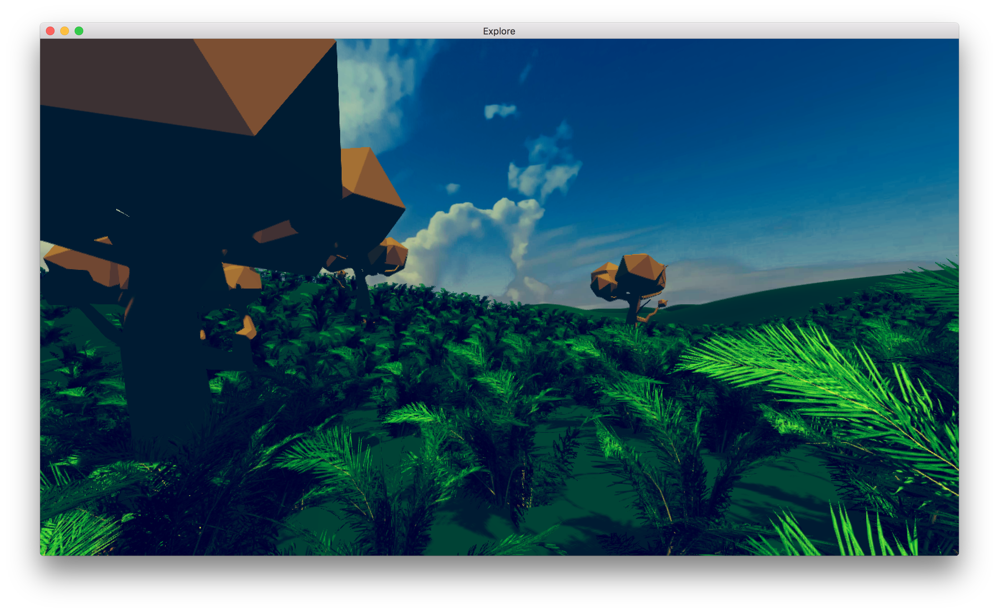

# OpenGL rendering demo

## Features

- Randomly generated terrain
- Asset streaming
- Reloadable C and shader code
- Post processing
- Editable levels with entity inspector
- Profiling code
- Multiplatform (osx and windows)
- Asset preprocessing
- Save and load level files

### Preview

#### Grass entity

